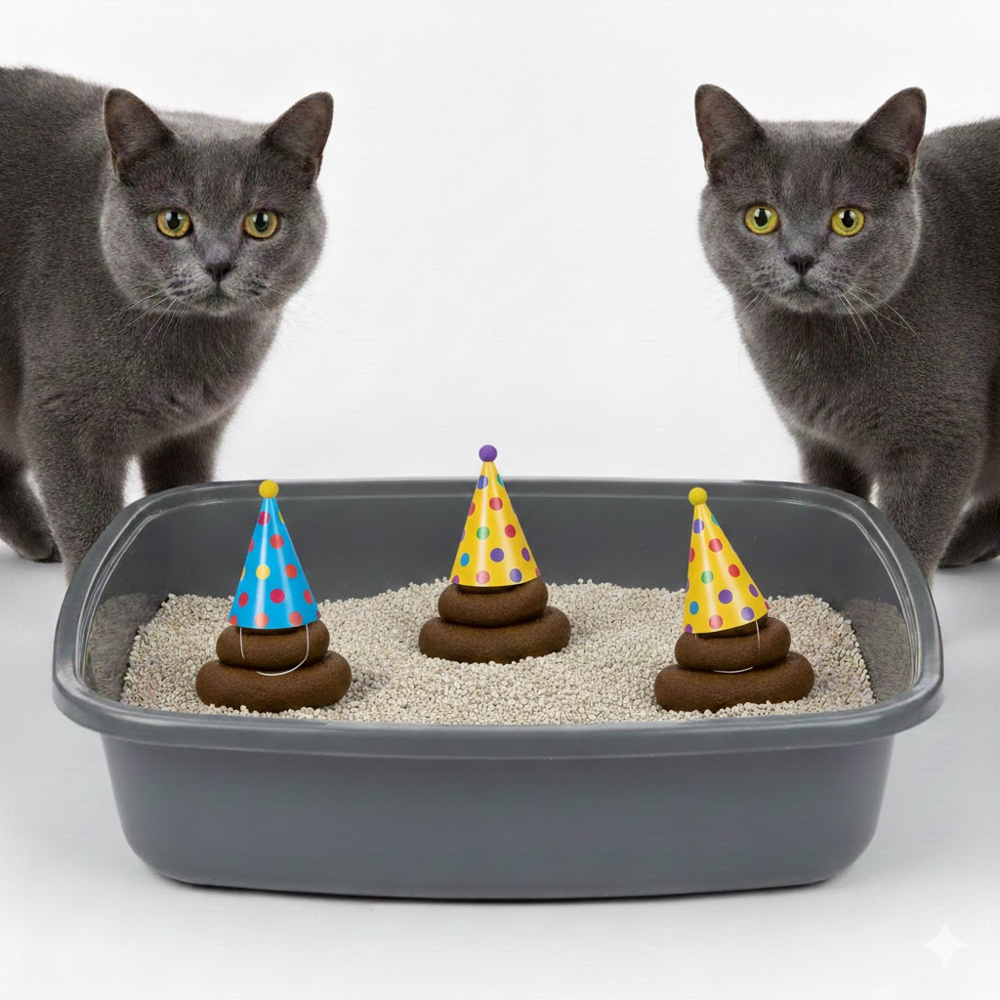

# Litterbox

Review *outputs*, not *actions*: give your AI agents litter trays to poop into.

> [!WARNING]
> Litterbox is in the proof of concept stage. Because it works by directly updating your Git index, bugs may cause data loss. Please use at your own risk.

  

---

## Brief

Litterbox is a tool for sandboxing coding agents, allowing them to safely mutate code and execute commands without affecting the host system, or each other. As changes are made to the sandboxed working tree, Litterbox automatically stages the changes in your Git index for your review. Ports on the container can be forwarded to your host machine, allowing you to interact with APIs or frontends running in the sandbox.

## Installation

See [the documentation](https://litterbox.throw.party/docs/install).

## Configuration

See [the documentation](http://litterbox.throw.party/docs/project-setup).
