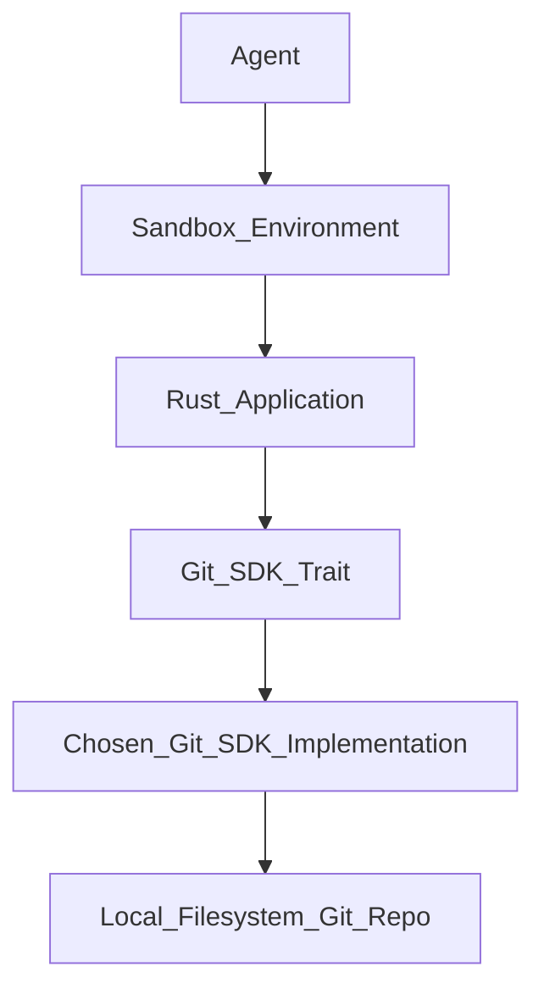
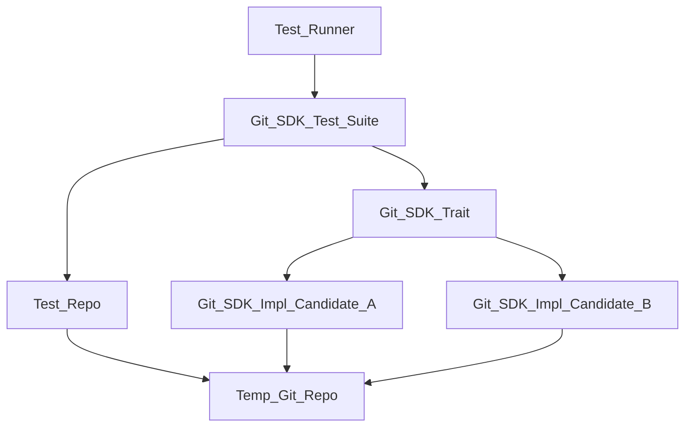

# Technical Plan for Git SDK Selection

## 1. Architecture Overview

The architecture for selecting a Git SDK for this Rust project will revolve around a Proof of Concept (PoC) approach. The core idea is to define a common interface (a Rust trait) for the required local Git operations. Candidate Git SDKs will then implement this trait, allowing for a standardized evaluation against a comprehensive test suite.

The chosen SDK will operate directly on the local filesystem within the sandbox environment, performing all specified Git operations without external network or authentication dependencies.

## 2. Technology Stack Justification

*   **Language:** Rust. The project is a Rust project, so the chosen SDK must be compatible with Rust. This necessitates either a native Rust Git SDK or Rust bindings for a C/C++ library.
*   **Git SDK Candidates for PoC:**
    *   **`git2-rs` (Rust bindings for `libgit2`):** `libgit2` is a well-established, mature, and widely used C library providing a robust API for Git operations. `git2-rs` offers idiomatic Rust bindings. Its maturity and comprehensive feature set make it a strong primary candidate.
    *   **`gix` (formerly `gitoxide`):** A pure Rust implementation of Git. This candidate offers the advantage of avoiding C FFI (Foreign Function Interface) overhead and potential complexities, leading to a more "Rust-native" solution. It's a promising alternative if `git2-rs` presents unforeseen issues or if a pure Rust solution is preferred for long-term maintainability and security.
    *   **`git-cli` (via `std::process::Command`):** While not a true SDK, wrapping the native `git` command-line interface via Rust's `std::process::Command` can serve as a baseline for performance and functionality comparison. It's a viable fallback if no suitable SDK is found, though it introduces external process management overhead.
*   **Testing Framework:** `cargo test`. The standard Rust testing framework will be used for unit and integration tests, leveraging its capabilities for test organization and execution.
*   **Temporary File Management:** `tempfile` crate. This will be used to create isolated, temporary Git repositories for each test case, ensuring a clean and reproducible testing environment.

## 3. Component Breakdown

The PoC will consist of the following Rust components:

*   **`git_sdk_trait`:** A public Rust trait that defines the common interface for all required local Git operations, as outlined in the Functional Requirements (FR1.1-FR1.10) of the `spec.md`. This includes methods for `init`, `commit`, `branch`, `checkout`, `log`, `squash`, `diff`, `apply_patch`, `add`, and `status`.
*   **`git_sdk_impl_git2_rs`:** A Rust struct that implements the `git_sdk_trait` using the `git2-rs` crate. This will be one of the primary candidates for evaluation.
*   **`git_sdk_impl_gix`:** A Rust struct that implements the `git_sdk_trait` using the `gix` crate. This will be the pure Rust alternative for evaluation.
*   **`git_sdk_impl_cli` (Optional):** A Rust struct that implements the `git_sdk_trait` by executing native `git` CLI commands via `std::process::Command`. This serves as a robust baseline and potential fallback.
*   **`git_sdk_test_suite`:** A comprehensive Rust test module that contains integration tests written against the `git_sdk_trait`. These tests will verify the correctness and adherence to the specification for each implemented method.
*   **`test_repo`:** A utility module responsible for programmatically creating, initializing, and cleaning up temporary Git repositories for the test suite.

## 4. Data Flow Diagrams

### 4.1 High-Level Interaction (Post-Selection)

*   The `Agent` interacts with the `Rust_Application` within the `Sandbox_Environment`.
*   The `Rust_Application` utilizes the `Git_SDK_Trait` to perform Git operations.
*   The `Chosen_Git_SDK_Implementation` (e.g., `git2-rs` or `gix`) executes these operations directly on the `Local_Filesystem_Git_Repo`.

### 4.2 Proof of Concept (PoC) Test Flow

*   The `Test_Runner` (e.g., `cargo test`) executes the `Git_SDK_Test_Suite`.
*   The `Git_SDK_Test_Suite` uses the `Test_Repo` to set up `Temp_Git_Repo` instances.
*   The `Git_SDK_Test_Suite` then runs tests against the `Git_SDK_Trait`, which is implemented by each `Git_SDK_Impl_Candidate` (e.g., `git2-rs`, `gix`).
*   Each candidate implementation interacts with its respective `Temp_Git_Repo`.

## 5. Testing Strategy

The testing strategy is central to the PoC phase and will ensure a rigorous evaluation of candidate SDKs.

*   **Unit Tests:** Individual functions and modules within each `git_sdk_impl_X` will have unit tests to ensure their internal logic is correct.
*   **Integration Tests (PoC Test Suite):**
    *   A comprehensive suite of integration tests will be developed against the `git_sdk_trait`.
    *   Each test will create a pristine, isolated Git repository using the `test_repo` to prevent test interference.
    *   The test suite will cover all Functional Requirements (FR1.1-FR1.10) and Edge Cases (EC1.1-EC5.1) defined in the `spec.md`.
    *   Specific scenarios for creating commits (full tree snapshots), squashing, diffing, and applying patches will be thoroughly tested.
    *   **Performance Benchmarking:** Tests will include benchmarks for key operations (`init`, `commit`, `squash`, `diff`, `apply_patch`) to measure performance against NFR1.1 and NFR1.2. This will involve running operations on a reference repository (e.g., a large synthetic repo or a subset of a real large repo like the Linux kernel) and comparing against native Git CLI performance.
*   **PoC Execution:** The `git_sdk_test_suite` will be executed against each candidate implementation (`git_sdk_impl_git2_rs`, `git_sdk_impl_gix`, etc.). The results (pass/fail, performance metrics, resource usage) will directly inform the SDK selection process, fulfilling AC1.6, AC2.1, and AC2.2.

## 6. Deployment Considerations

*   **Sandbox Environment Integration:** The chosen Git SDK (and any of its underlying dependencies, such as `libgit2` for `git2-rs`) must be made available within the sandbox container. This directly addresses `ER1.2` from the `spec.md`. This can be achieved either by including it in the `container.base-image` or by installing it via `container.setup-command`.
*   **Rust Toolchain:** A complete and functional Rust toolchain (compiler, Cargo) must be present in the sandbox environment to build and run the Rust application that utilizes the Git SDK. This fulfills `ER1.1`.
*   **Local-Only Operation:** Since the SDK is strictly for local Git operations, there are no external network configurations, authentication mechanisms, or remote service dependencies to manage during deployment.
*   **Binary Size and Dependencies:** The final binary size of the Rust application linked with the chosen SDK should be considered, especially if `libgit2` (a C library) is a dependency, as it might increase the container image size.
*   **Cross-Compilation:** If the sandbox environment's architecture differs from the development environment, cross-compilation of the Rust application will be necessary.

## 7. Risks and Mitigation Strategies

*   **Risk: Candidate SDKs do not meet performance requirements (NFR1.1, NFR1.2).**
    *   **Mitigation:** The PoC phase includes explicit performance benchmarking. If primary candidates fall short, investigate optimizations, consider the `git-cli` wrapper as a fallback, or re-evaluate the scope of performance requirements.
*   **Risk: Candidate SDKs have critical bugs, stability issues, or unhandled edge cases.**
    *   **Mitigation:** The comprehensive test suite (covering FRs and ECs) is designed to expose these. Prioritize SDKs with active communities, good documentation (NFR4.1, NFR4.2), and a clear release cycle (NFR4.4).
*   **Risk: Difficulty in implementing `git_sdk_trait` for a candidate SDK due to API limitations or complexity.**
    *   **Mitigation:** Start with the most mature and well-documented candidate (`git2-rs`). If significant challenges arise, re-evaluate the `git_sdk_trait` definition for feasibility or pivot to another candidate.
*   **Risk: Sandbox environment setup for PoC is challenging or incomplete (ER1.1, ER1.2).**
    *   **Mitigation:** Prioritize and thoroughly test the sandbox environment setup. Document all steps for installing the Rust toolchain and Git SDK dependencies. If a candidate SDK has unusually complex build requirements, this will be a negative factor in its evaluation.
*   **Risk: `git2-rs` (due to `libgit2` dependency) introduces C FFI complexities, memory management issues, or security concerns.**
    *   **Mitigation:** Thoroughly evaluate `gix` (pure Rust) as a strong alternative. Ensure `libgit2` is kept up-to-date with security patches. The `git_sdk_trait` abstracts away these underlying details, allowing for easier switching if necessary.
*   **Risk: The chosen SDK's API does not align with Rust's idiomatic practices (NFR5.1).**
    *   **Mitigation:** This will be a key evaluation criterion during the PoC. If the API is too un-idiomatic, it will increase the learning curve (Secondary Goal) and reduce maintainability. This could lead to selecting a more idiomatic alternative or creating a thin wrapper around the chosen SDK to provide a more Rust-native interface.
