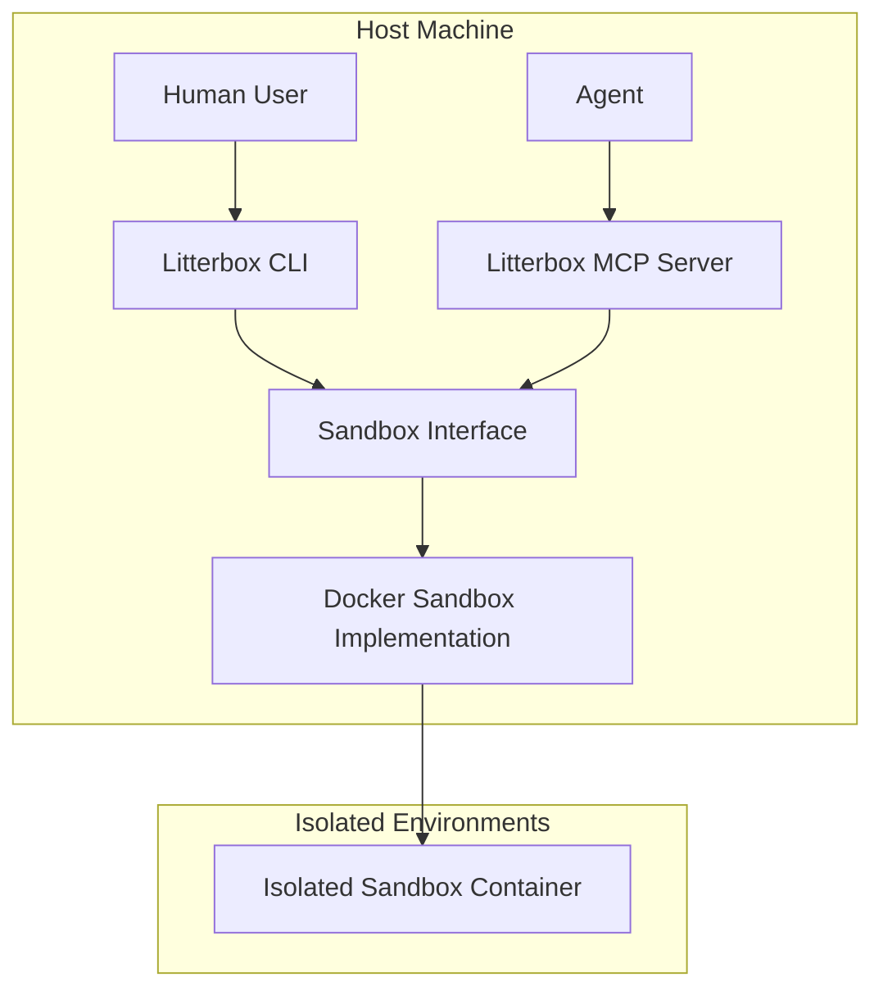
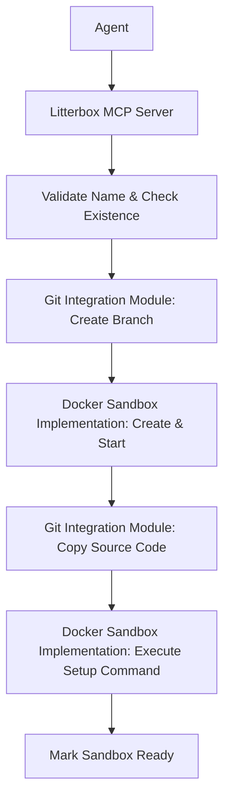
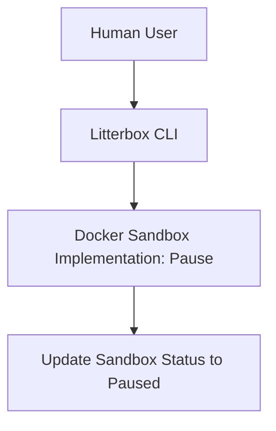
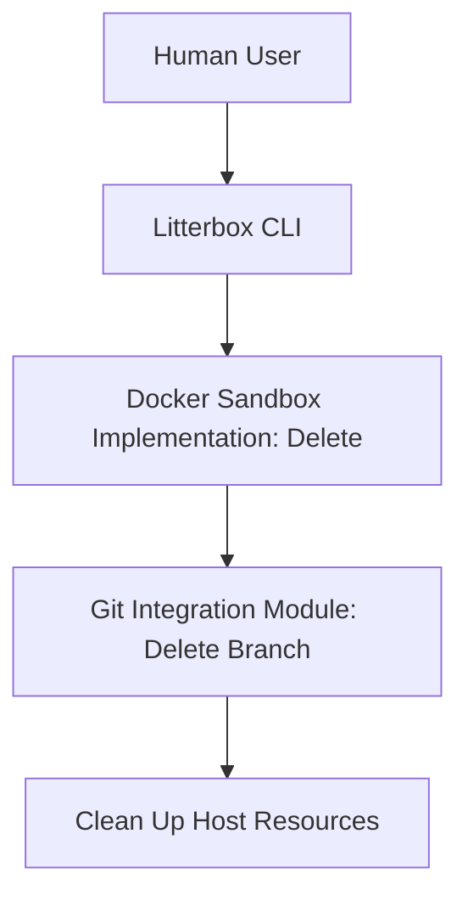

# ADR: Sandboxes - Technical Plan

## 1. Architecture Overview

The sandbox feature will introduce a robust, layered architecture within Litterbox, designed to provide isolated execution environments for agents while maintaining host system security and extensibility.

### 1.1 Core Idea: Sandbox Manager

A central "Sandbox Manager" component will be responsible for orchestrating the entire lifecycle of sandboxes, including creation, pausing, resumption, and deletion. It will also mediate all interactions between agents/CLI and the sandboxed environments.

### 1.2 Layered Architecture

The system will follow a layered design to ensure clear separation of concerns and facilitate future extensions.

*   **Litterbox CLI**: A standalone command-line tool for human interaction (pause, delete, list). It interacts directly with the Sandbox Interface.
*   **Litterbox MCP Server**: Service implementing the Model Control Protocol, handling requests from agents and interacting with the Sandbox Interface.
*   **Sandbox Interface**: A technology-agnostic abstraction defining the lifecycle and interaction methods for a sandbox.
*   **Sandbox Implementations**: Concrete providers (e.g., Docker) that realize the Sandbox Interface.

### 1.3 Isolation Principles

Adhering to FR4, the architecture will enforce strong isolation:
*   **Compute Isolation**: Agent commands are executed strictly within the container.
*   **Storage Isolation**: Source code is copied into the container; no bind mounts to the host filesystem.

## 2. Technology Stack Justification

*   **Primary Language: Rust**: Litterbox's core will be implemented in Rust.
    *   **Justification**: Rust provides memory safety without a garbage collector, ensuring high performance and reliability for system-level components. Its strong type system and ownership model are ideal for building secure sandbox abstractions. The existing evaluation of Rust MCP server implementations in the project makes it the consistent choice.
*   **Container Runtime: Docker**: The initial implementation will leverage Docker.
    *   **Justification**: Docker is a mature, widely adopted containerization platform with a rich ecosystem and a well-documented API. This allows for rapid initial development and provides a solid foundation for isolation. The `busybox:latest` image will be used as per FR1.5.
*   **Git Operations: `git2-rs`**: For managing Git branches and copying repository contents.
    *   **Justification**: Using Rust bindings for `libgit2` provides programmatic control over Git operations with high performance and reliability, avoiding reliance on external `git` CLI commands.
*   **Inter-process Communication: MCP (Model Control Protocol)**: For agent-Litterbox communication.
    *   **Justification**: MCP is the established protocol for agent interaction within Litterbox, ensuring consistency and interoperability.

## 3. Component Breakdown

### 3.1 Litterbox MCP Server
*   **Responsibilities**:
    *   Exposes MCP tools (e.g., `sandbox-create`) to agents.
    *   Handles internal requests from the Litterbox CLI.
    *   Coordinates high-level sandbox lifecycle orchestration.
    *   Integrates with the Git Integration Module for branch and source code management.
    *   Uses the Sandbox Interface to interact with isolated environments.
    *   Manages sandbox metadata and status records.

### 3.2 Sandbox Interface
*   **Responsibilities**: Defines the contract for all sandbox operations, ensuring the MCP server remains agnostic of the underlying container technology.
*   **Key Methods**:
    *   `Create(name string, config SandboxConfig) error`
    *   `Start() error`
    *   `Stop() error`
    *   `Pause() error`
    *   `Resume() error`
    *   `Destroy() error`
    *   `Execute(command []string) (ExecutionResult, error)`
    *   `Upload(srcPath, destPath string) error`

### 3.3 Docker Sandbox Implementation
*   **Responsibilities**: Realizes the Sandbox Interface using the Docker Engine API.
*   **Key Operations**:
    *   Manages Docker container lifecycle (Create, Start, Pause, Kill, Remove).
    *   Pulls and uses the `busybox:latest` image.
    *   Handles the physical transfer of the project source code into the container filesystem.
    *   Configures container-level isolation (read-only mounts, network restrictions).

### 3.4 Git Integration Module
*   **Responsibilities**:
    *   Creates new Git branches based on a slugified sandbox name from `HEAD`.
    *   Deletes Git branches upon sandbox deletion.
    *   Performs `git clone` or `git checkout` and `git archive` operations to prepare source code for copying into containers.
    *   Ensures that changes within the sandbox are tracked against its dedicated branch for future `litterbox apply`/`merge` operations.

### 3.5 Configuration Parser
*   **Responsibilities**:
    *   Reads and parses the `.litterbox.toml` file from the repository root.
    *   Validates the configuration schema.
    *   Provides structured configuration data (e.g., `setup-command`, resource limits, network rules) to the Sandbox Manager and Docker Sandbox Provider.
    *   Handles default values when configurations are not explicitly provided.

## 4. Data Flow Diagrams

### 4.1 `sandbox-create` Flow

### 4.2 `litterbox pause` Flow

### 4.3 `litterbox delete` Flow

## 5. Testing Strategy

A comprehensive testing strategy will be employed to ensure the reliability, security, and correctness of the sandbox feature.

*   **Unit Tests**:
    *   **Scope**: Individual functions and methods within each component (Sandbox Manager logic, Git utilities, Configuration Parser, Docker Sandbox Provider methods).
    *   **Focus**: Verify correct behavior of isolated units, edge cases, and error conditions.
    *   **Tools**: Go's built-in testing framework.
*   **Integration Tests**:
    *   **Scope**: Interactions between components and with external dependencies (Docker daemon, Git repository).
    *   **Focus**:
        *   Agent-Litterbox interaction via MCP tools (e.g., `sandbox-create` returns correct sandbox ID).
        *   CLI-Litterbox interaction (e.g., `litterbox pause` correctly pauses a container).
        *   Full sandbox lifecycle: create -> exec command -> pause -> resume -> delete.
        *   Verification of isolation properties (FR4): Attempting to read/write host files, network access control.
        *   Error handling for external dependencies (e.g., Docker daemon unavailable, Git command failure).
    *   **Environment**: Dedicated test environment with a running Docker daemon.
*   **End-to-End Tests**:
    *   **Scope**: Full user journeys as described in `spec.md`.
    *   **Focus**: Validate the entire system from the user's perspective, including CLI commands and agent MCP tool calls.
    *   **Tools**: Scripted tests simulating user/agent interactions.
*   **Security Testing**:
    *   **Scope**: Focus on FR4 (Isolation) and NFR2 (Security).
    *   **Techniques**:
        *   **Container Escape Attempts**: Deliberately try to break out of the sandbox to access the host filesystem or processes.
        *   **Resource Exhaustion**: Test resource limits (CPU, memory, disk I/O) to ensure they are enforced.
        *   **Network Policy Bypass**: Attempt to bypass network isolation rules.
        *   **Vulnerability Scanning**: Use tools to scan the Docker images and container configurations for known vulnerabilities.

## 6. Deployment Considerations

*   **Litterbox Server Deployment**: The Litterbox server, including the Sandbox Manager, will be deployed as a long-running daemon on the host machine. It will require appropriate permissions to interact with the Docker daemon.
*   **Docker Daemon Requirement**: The host machine must have a Docker daemon installed and running. The Litterbox server will communicate with it via its API (e.g., Unix socket or TCP).
*   **Resource Management**:
    *   **Host Resource Monitoring**: Implement monitoring for host CPU, memory, and disk usage to detect potential resource contention or exhaustion caused by multiple active sandboxes.
    *   **Configurable Limits**: Ensure that resource limits defined in `.litterbox.toml` (NFR4) are correctly applied to Docker containers.
*   **Logging**:
    *   **Comprehensive Logging**: Implement detailed logging for all sandbox lifecycle events (creation, pause, delete), agent interactions, and any errors encountered.
    *   **Structured Logs**: Use structured logging (e.g., JSON) to facilitate analysis and integration with log management systems.
*   **Observability**:
    *   **Metrics**: Expose metrics (e.g., Prometheus format) for key performance indicators such as sandbox creation/deletion times, number of active/paused sandboxes, and resource utilization per sandbox.
    *   **Tracing**: Consider distributed tracing for complex operations involving multiple components.
*   **Security Hardening**:
    *   **Principle of Least Privilege**: Ensure the Litterbox server runs with the minimum necessary privileges.
    *   **Docker Socket Access**: Secure access to the Docker socket.
    *   **Image Trust**: While `busybox:latest` is used initially, for future configurable images, consider image signing and verification.
*   **Backup and Recovery**: While sandboxes are ephemeral, the underlying Git repository is critical. Ensure robust Git backup strategies are in place.
*   **Scalability**: The initial Docker implementation will scale vertically on a single host. Future extensibility to other orchestrators (NFR1) will address horizontal scalability.
