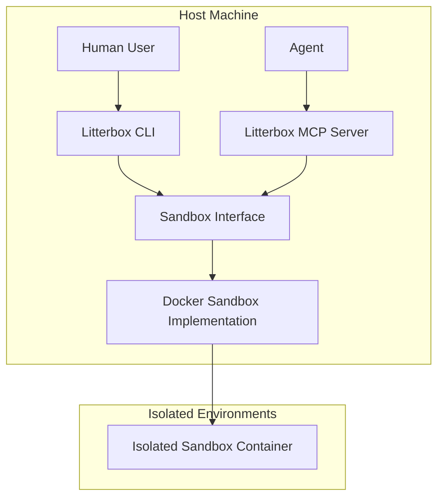
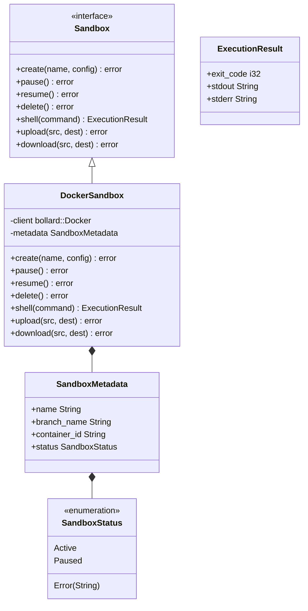
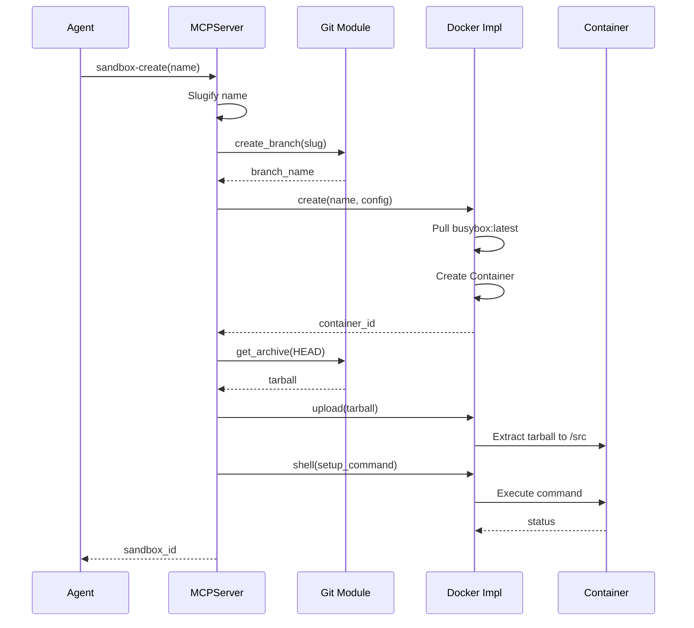
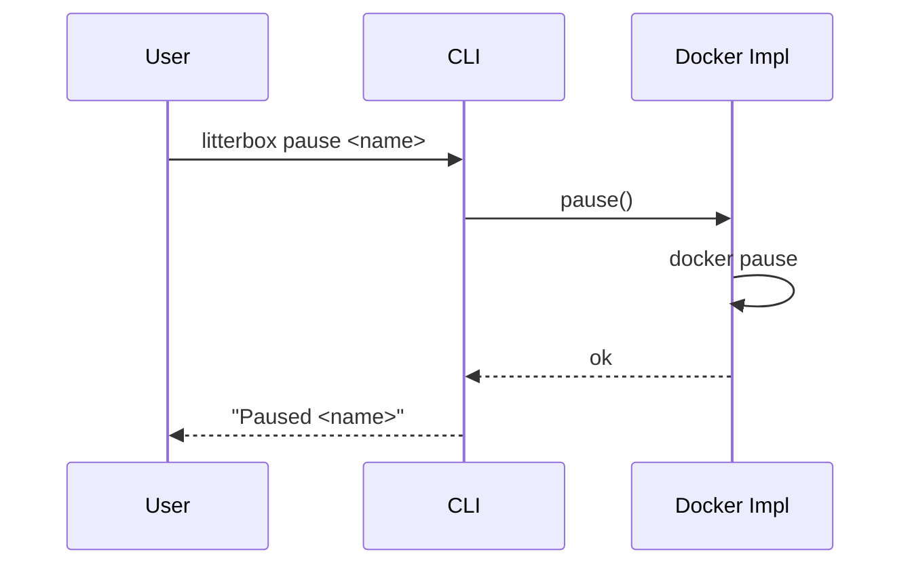
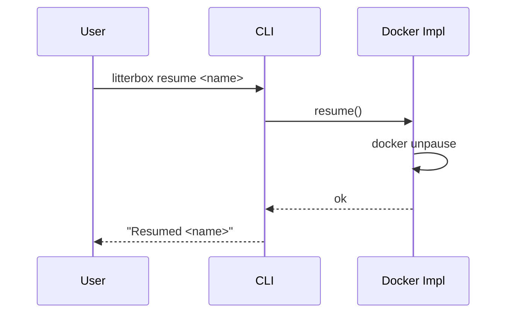
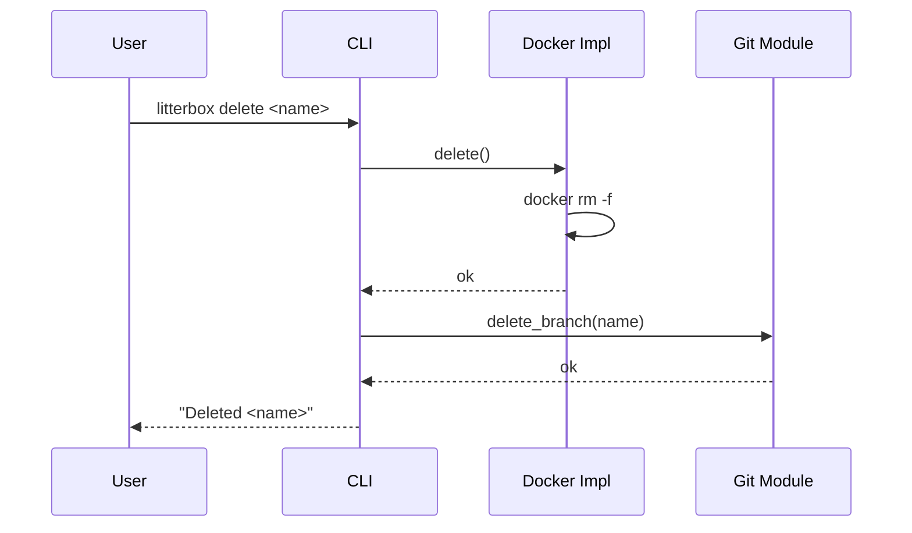
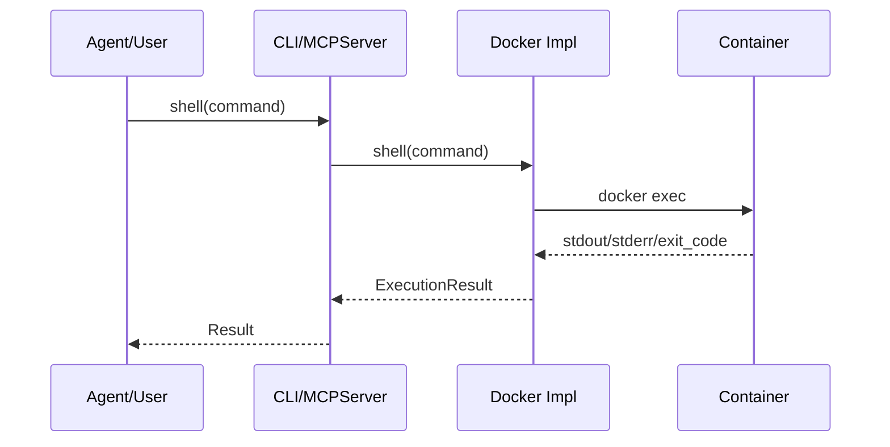

# ADR: Sandboxes - Technical Plan

## 1. Architecture Overview

The sandbox feature will introduce a robust, layered architecture within Litterbox, designed to provide isolated execution environments for agents while maintaining host system security and extensibility.

### 1.1 Core Idea: Sandbox Interface

The core abstraction is a Sandbox Interface with a Docker-backed implementation. Both the MCP server and the standalone CLI operate through this interface, keeping container-specific logic isolated in the Docker implementation.

### 1.2 Layered Architecture

The system will follow a layered design to ensure clear separation of concerns and facilitate future extensions.



*   **Litterbox CLI**: A standalone command-line tool for human interaction (pause, delete, list). It interacts directly with the Sandbox Interface.
*   **Litterbox MCP Server**: Service implementing the Model Control Protocol, handling requests from agents and interacting with the Sandbox Interface.
*   **Sandbox Interface**: A technology-agnostic abstraction defining the lifecycle and interaction methods for a sandbox.
*   **Sandbox Implementations**: Concrete providers (e.g., Docker) that realize the Sandbox Interface.


### 1.3 Isolation Principles

Adhering to FR4, the architecture will enforce strong isolation:
*   **Compute Isolation**: Agent commands are executed strictly within the container.
*   **Storage Isolation**: Source code is copied into the container; no bind mounts to the host filesystem.

## 2. Technology Stack Justification

*   **Primary Language: Rust**: Litterbox's core will be implemented in Rust.
    *   **Justification**: Rust provides memory safety without a garbage collector, ensuring high performance and reliability for system-level components. Its strong type system and ownership model are ideal for building secure sandbox abstractions. The existing evaluation of Rust MCP server implementations in the project makes it the consistent choice.
*   **Container Runtime: Docker (via `bollard`)**: The initial implementation will leverage Docker using the `bollard` crate.
    *   **Justification**: `bollard` is the de-facto asynchronous Docker client for Rust, providing a clean API for interacting with the Docker daemon. Docker offers a mature foundation for isolation, and `busybox:latest` will be used as the base image as per FR1.5.
*   **Git Operations: `git2-rs`**: For managing Git branches and copying repository contents.
    *   **Justification**: Using Rust bindings for `libgit2` provides programmatic control over Git operations with high performance and reliability, avoiding reliance on external `git` CLI commands.
*   **Inter-process Communication: MCP (Model Control Protocol)**: For agent-Litterbox communication.
    *   **Justification**: MCP is the established protocol for agent interaction within Litterbox, ensuring consistency and interoperability.

## 3. Component Breakdown

### 3.1 Litterbox MCP Server
*   **Responsibilities**:
    *   Exposes MCP tools (e.g., `sandbox-create`) to agents.
    *   Handles internal requests from the Litterbox CLI.
    *   Coordinates high-level sandbox lifecycle orchestration.
    *   Integrates with the Git Integration Module for branch and source code management.
    *   Uses the Sandbox Interface to interact with isolated environments.
    *   Manages sandbox metadata and status records.

### 3.2 Sandbox Interface
*   **Responsibilities**: Defines the contract for all sandbox operations, ensuring the MCP server and CLI remain agnostic of the underlying container technology.
*   **Key Methods**:
    *   `Create(name string, config SandboxConfig) error`: Create a new sandbox (container + branch) and copy the repository contents into it.
    *   `Pause() error`: Pause a running sandbox while preserving its state.
    *   `Resume() error`: Resume a paused sandbox, restoring its state.
    *   `Delete() error`: Permanently remove the sandbox and associated resources.
    *   `Shell(command []string) (ExecutionResult, error)`: Execute a command inside the sandbox, matching CLI semantics.
    *   `Upload(srcPath, destPath string) error`: Copy files from host into the sandbox.
    *   `Download(srcPath, destPath string) error`: Copy files from the sandbox back to the host.

### 3.3 Docker Sandbox Implementation
*   **Responsibilities**: Realizes the Sandbox Interface using the `bollard` crate to communicate with the Docker Engine API.
*   **Key Operations**:
    *   Manages Docker container lifecycle via asynchronous requests to the daemon.
    *   Pulls and uses the `busybox:latest` image.
    *   Handles the physical transfer of the project source code into the container filesystem (e.g., via `tar`).
    *   Configures container settings required for compute and storage isolation.
    *   Names containers using the repository root basename to avoid cross-project collisions (`litterbox-<repo>-<slug>`).

### 3.4 Git Integration Module
*   **Responsibilities**:
    *   Creates new Git branches named `litterbox/<slug>` based on a slugified sandbox name from `HEAD`.
    *   Deletes Git branches upon sandbox deletion.
    *   Performs `git clone` or `git checkout` and `git archive` operations to prepare source code for copying into containers.
    *   Ensures that changes within the sandbox are tracked against its dedicated branch for future `litterbox apply`/`merge` operations.

### 3.5 Data Models and Type Map

The following Rust structures and enums define the core data models for the sandbox system.

```rust
/// Configuration for sandbox creation
pub struct SandboxConfig {
    /// Optional setup command to run after container start
    pub setup_command: Option<Vec<String>>,
}

/// Result of a command execution within a sandbox
pub struct ExecutionResult {
    /// The exit status of the command
    pub exit_code: i32,
    /// Standard output captured from the command
    pub stdout: String,
    /// Standard error captured from the command
    pub stderr: String,
}

/// Current status of a sandbox
pub enum SandboxStatus {
    /// Sandbox is active and container is running
    Active,
    /// Sandbox is paused; state is preserved
    Paused,
    /// Sandbox encountered an error during a transition
    Error(String),
}

/// Metadata for a managed sandbox
pub struct SandboxMetadata {
    /// Slugified unique name
    pub name: String,
    /// Associated Git branch name
    pub branch_name: String,
    /// ID of the underlying Docker container
    pub container_id: String,
    /// Current operational status
    pub status: SandboxStatus,
}
```

### 3.6 Class Hierarchy

This diagram visualizes the relationships between the technology-agnostic interface and its concrete Docker implementation.



## 4. Data Flow Diagrams

### 4.1 `sandbox-create` Flow



### 4.2 `litterbox pause` Flow



### 4.3 `litterbox resume` Flow



### 4.4 `litterbox delete` Flow



### 4.5 `shell` Flow



## 5. Testing Strategy

A focused testing strategy will be employed to ensure the reliability and correctness of the sandbox feature.

*   **Unit Tests**:
    *   **Scope**: Pure logic and small units (name validation/slugification, branch naming, state transitions, request/response mapping, tar packaging for upload/download).
    *   **Focus**: Idempotency (pause/delete), error mapping (Docker/Git errors to user-facing failures), and correctness of command output handling.
    *   **Approach**: Mock Docker client and Git operations; run fast and deterministically.
    *   **Tools**: Rust's built-in testing framework (`cargo test`).
*   **Integration Tests**:
    *   **Scope**: Real Docker + git2-rs with a temporary test repository.
    *   **Focus**:
        *   Full lifecycle: create -> shell -> pause -> resume -> delete.
        *   Branch creation/removal aligned to sandbox name.
        *   Source copy into container (no bind mount) and file transfer (upload/download).
        *   Compute and storage isolation (commands run in container; host repo unaffected).
        *   Failure modes: Docker unavailable, branch creation failure, missing image.
    *   **Environment**: Dedicated test environment with a running Docker daemon.
*   **Interface Contract Tests**:
    *   **Scope**: Behavioral tests for the Sandbox Interface independent of the caller (CLI/MCP).
    *   **Focus**: Method semantics (Create/Pause/Delete/Shell/Upload/Download) and state transitions.
    *   **Approach**: Run against the Docker implementation to lock the contract for future providers.
*   **Per-Method Checklist**:
    *   **Create**: Creates a new branch, provisions a container, copies repository contents, and returns a sandbox identifier.
    *   **Pause**: Idempotent pause; repeated calls succeed without changing state.
    *   **Resume**: Idempotent resume; repeated calls succeed without changing state.
    *   **Delete**: Removes container and branch; repeated calls return a clear not-found error.
    *   **Shell**: Executes commands inside the container and returns exit code/stdout/stderr.
    *   **Upload**: Copies files into the container with correct paths and permissions.
    *   **Download**: Copies files from the container to the host with correct paths and permissions.
*   **Negative and Error Cases**:
    *   Duplicate sandbox name returns a clear error and leaves no partial state.
    *   Invalid sandbox name is rejected before any Git/Docker operations.
    *   Docker unavailable / image pull failure yields a clear error and no orphaned branch.
    *   Git branch creation failure yields a clear error and no container created.
    *   Shell command non-zero exit returns a failure with captured stderr/stdout.
*   **CLI/MCP Output and Exit Codes**:
    *   **CLI**: Exit code `0` on success, non-zero on failure; success summaries to stdout, errors to stderr.
    *   **MCP**: Successful calls return structured success payloads; failures return structured errors (no reliance on stdout/stderr).
*   **End-to-End Tests**:
    *   **Scope**: Full user journeys as described in `spec.md`.
    *   **Focus**: CLI commands (`pause`, `resume`, `delete`) and MCP tool calls (`sandbox-create`) with expected stderr/output and exit codes.
    *   **Tools**: Scripted tests simulating user/agent interactions.

## 6. Deployment Considerations

*   **MCP Server Execution**: The MCP server is launched on demand and communicates with a host process via stdio. It is not a long-running daemon.
*   **Docker Daemon Requirement**: The host machine must have a Docker daemon installed and running. The MCP server and CLI will communicate with it via its API (e.g., Unix socket or TCP).
*   **Logging**: For now, write operational logs to stderr.
