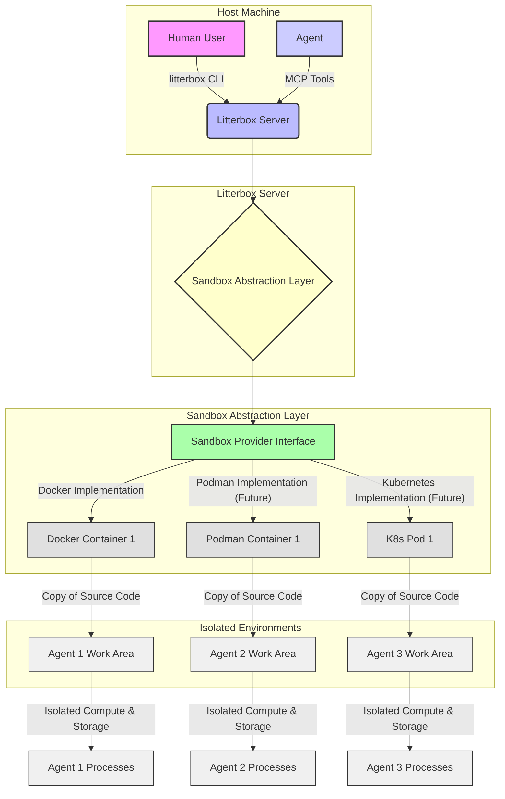

# ADR: Sandboxes - Core Abstraction

## 1. Goals

The primary goals for the sandbox abstraction in Litterbox are to:

*   **Isolate Agent Work**: Ensure that individual agents' computational processes (execution of commands, running servers) and storage (project source code, supporting applications) are completely isolated from each other and from the host system.
*   **Prevent Disruption**: Guarantee that the work of one agent cannot disrupt or interfere with the work of another agent or the host environment.
*   **Secure Host System**: Prevent agents from gaining direct access to the host filesystem, repository, or any sensitive resources. All agent interactions must be mediated and controlled.
*   **Enable Extensibility**: Design the sandbox abstraction to be flexible enough to support different underlying container providers (e.g., Docker, Podman, Kubernetes) in the future, beyond the initial Docker implementation.
*   **Provide Clear Interaction Mechanisms**: Define precise MCP tools for agents to interact with their sandboxed environment and clear CLI subcommands for human users to manage sandboxes.

## 2. User Journeys

### 2.1 Agent Creating a Sandbox

**Scenario**: An agent needs a clean, isolated environment to perform a task.

1.  **Agent Action**: The agent invokes the `sandbox-create` MCP tool with a desired sandbox name (e.g., `sandbox-create("feature-x-dev")`).
2.  **System Response**:
    *   Litterbox checks if a sandbox with that name already exists. If so, it returns an error.
    *   Litterbox slugifies the provided name (e.g., "feature-x-dev" becomes "feature-x-dev").
    *   Litterbox creates a new Git branch based on the current `HEAD` of the repository, using the slugified name.
    *   Litterbox provisions a Docker container for the sandbox.
    *   Litterbox copies the entire project source code into the newly provisioned container. This is a copy, not a bind mount.
    *   Litterbox executes a fixed startup command (`echo hello world`) within the container. Configuration via `.litterbox.toml` is deferred.
    *   The sandbox is now ready for the agent to interact with using other MCP tools (e.g., `sandbox-exec`, `sandbox-read`, `sandbox-write`).

### 2.2 Human Pausing Sandboxes

**Scenario**: A human user wants to temporarily suspend one or more sandbox environments to conserve resources or for maintenance.

1.  **Human Action (Single Sandbox)**: The human user runs `litterbox pause <ENV_NAME>` (e.g., `litterbox pause feature-x-dev`).
2.  **System Response**: Litterbox gracefully pauses the specified sandbox container, preserving its current state.
3.  **Human Action (All Sandboxes in Repo)**: The human user runs `litterbox pause --all-envs`.
4.  **System Response**: Litterbox gracefully pauses all active sandbox containers associated with the current repository.
5.  **Human Action (All Sandboxes Across All Repos)**: The human user runs `litterbox pause --all-repos`.
6.  **System Response**: Litterbox gracefully pauses all active sandbox containers managed by Litterbox across all configured repositories.

### 2.3 Human Resuming a Sandbox

**Scenario**: A human user wants to resume a previously paused sandbox.

1.  **Human Action**: The human user runs `litterbox resume <ENV_NAME>` (e.g., `litterbox resume feature-x-dev`).
2.  **System Response**: Litterbox resumes the specified sandbox container, restoring its state.

### 2.4 Human Deleting a Sandbox

**Scenario**: A human user wants to permanently remove a sandbox environment and its associated resources.

1.  **Human Action**: The human user runs `litterbox delete <ENV_NAME>` (e.g., `litterbox delete feature-x-dev`).
2.  **System Response**:
    *   Litterbox terminates and removes the specified sandbox container.
    *   Litterbox deletes the Git branch associated with the sandbox.
    *   Litterbox cleans up any host-side resources (e.g., temporary directories, network configurations) that were created for this sandbox. The sandbox is completely purged.

## 3. Functional Requirements

*   **FR1: Sandbox Creation (`sandbox-create`)**
    *   **FR1.1**: The system SHALL create a unique sandbox environment upon request via the `sandbox-create(name)` MCP tool.
    *   **FR1.2**: The sandbox environment SHALL be initialized based on the current `HEAD` of the repository where the `sandbox-create` command is issued.
    *   **FR1.3**: A new Git branch SHALL be created for each sandbox, named `litterbox/<slug>`, branching off `HEAD`.
    *   **FR1.4**: A container (initially Docker) SHALL be provisioned for the sandbox.
    *   **FR1.5**: For the initial implementation, the sandbox SHALL exclusively use the `busybox:latest` Docker image. Configuration of alternative images is explicitly deferred and not a current requirement.
    *   **FR1.6**: The project source code SHALL be copied into the container. It MUST NOT be a bind mount to the host filesystem.
    *   **FR1.7**: A startup command (`echo hello world`) SHALL be executed once within the container during its initial creation. Configuration of a custom setup command is deferred.
    *   **FR1.8**: The `sandbox-create` tool SHALL return an error if a sandbox with the requested name already exists.
    *   **FR1.9**: The provided sandbox name SHALL be slugified by lowercasing, replacing non-alphanumeric characters with dashes, collapsing consecutive dashes to a single dash, and trimming leading and trailing dashes.
    *   **FR1.10**: After slugification, the name SHALL be validated as 1-63 characters and limited to `[a-z0-9-]`.
    *   **FR1.11**: Container names SHALL be prefixed with the repository root basename, slugified, and follow `litterbox-<repo>-<slug>` to avoid cross-project collisions.

*   **FR2: Sandbox Pausing and Resuming (`litterbox pause`, `litterbox resume`)**
    *   **FR2.1**: The `litterbox pause <ENV_NAME>` CLI subcommand SHALL gracefully pause the specified sandbox container, preserving its state for later resumption.
    *   **FR2.2**: The `litterbox pause --all-envs` CLI subcommand SHALL gracefully pause all active sandbox containers associated with the current repository.
    *   **FR2.3**: The `litterbox pause --all-repos` CLI subcommand SHALL gracefully pause all active sandbox containers managed by Litterbox across all configured repositories.
    *   **FR2.4**: The `litterbox resume <ENV_NAME>` CLI subcommand SHALL resume a paused sandbox container, restoring its state.

*   **FR3: Sandbox Deletion (`litterbox delete`)**
    *   **FR3.1**: The `litterbox delete <ENV_NAME>` CLI subcommand SHALL terminate and completely remove the specified sandbox container.
    *   **FR3.2**: The `litterbox delete <ENV_NAME>` CLI subcommand SHALL delete the Git branch associated with the sandbox.
    *   **FR3.3**: The `litterbox delete <ENV_NAME>` CLI subcommand SHALL clean up all host-side resources (e.g., network configurations, temporary storage) associated with the sandbox.

*   **FR4: Isolation**
    *   **FR4.1 (Compute Isolation)**: Agents' command execution SHALL be strictly isolated within their respective containers, preventing direct execution on the host.
    *   **FR4.2 (Storage Isolation)**: Agents SHALL operate exclusively on a copy of the source code within their container. There MUST be no direct access or bind mounts to the host filesystem.

*   **FR5: Source Code Management within Sandbox**
    *   **FR5.1**: The content of the sandbox at creation time SHALL be an exact copy of the project source code from the `HEAD` of the repository.
    *   **FR5.2**: Changes made by an agent within the sandbox container's filesystem SHALL NOT be automatically synced back to the host filesystem.
    *   **FR5.3**: Only changes to tracked files that are visible in a `git diff` within the sandbox's dedicated branch SHALL be considered for `litterbox apply` or `litterbox merge` operations.

## 4. Non-functional Requirements

*   **NFR1: Extensibility**: The sandbox system SHALL be designed with an abstraction layer that allows for the integration of alternative container providers in the future without requiring significant changes to the core logic or agent-facing APIs.
*   **NFR2: Security**: Sandboxes MUST provide a strong security boundary, preventing agents from escaping their container, accessing unauthorized host resources, or interfering with other sandboxes.
*   **NFR3: Performance**: Sandbox creation, pausing, resumption, and deletion operations SHALL complete within acceptable timeframes (e.g., creation within seconds, pause/resume within milliseconds).

## 5. Acceptance Criteria

*   **AC1: Sandbox Creation**
    *   **AC1.1**: A call to `sandbox-create("my-new-feature")` successfully provisions a new sandbox, and subsequent `litterbox list` shows "my-new-feature" as an active sandbox.
    *   **AC1.2**: After `sandbox-create`, `git branch` on the host shows a new branch named `litterbox/my-new-feature` that is a direct descendant of `HEAD`.
    *   **AC1.3**: Inside the created container, the project directory contains an exact copy of the source code from `HEAD` at the time of creation.
    *   **AC1.4**: The startup command (`echo hello world`) is executed during sandbox creation.
    *   **AC1.5**: Attempting `sandbox-create("my-new-feature")` again immediately after a successful creation SHALL result in an error message indicating the sandbox already exists, and no new sandbox or branch is created.
    *   **AC1.6**: A sandbox name like "My Feature Name!@#" is correctly slugified to "my-feature-name" for branch naming.
    *   **AC1.7**: The created container name includes the repo prefix and slug (e.g., `litterbox/my-repo` and `my-feature` results in `litterbox-my-repo-my-feature`).

*   **AC2: Sandbox Pausing and Resuming**
    *   **AC2.1**: Running `litterbox pause my-sandbox` stops the associated container, and `litterbox list` shows its status as "paused". Running `litterbox resume my-sandbox` restarts it, and its state is preserved.
    *   **AC2.2**: Running `litterbox pause --all-envs` pauses all sandboxes in the current repository, and `litterbox list` reflects their "paused" status.
    *   **AC2.3**: Running `litterbox pause --all-repos` pauses all sandboxes managed by Litterbox, and `litterbox list` across all repositories reflects their "paused" status.
    *   **AC2.4**: Running `litterbox resume my-sandbox` on a paused sandbox returns it to an "active" state, and `litterbox list` reflects the updated status.

*   **AC3: Sandbox Deletion**
    *   **AC3.1**: Running `litterbox delete my-sandbox` removes the container, and `litterbox list` no longer shows "my-sandbox".
    *   **AC3.2**: After `litterbox delete my-sandbox`, `git branch` on the host no longer lists `litterbox/my-sandbox`.
    *   **AC3.3**: After `litterbox delete my-sandbox`, no temporary files, network interfaces, or other host resources related to "my-sandbox" remain.

*   **AC4: Isolation**
    *   **AC4.1**: An agent attempting to execute a command like `ls /host/root` from within the sandbox SHALL fail with a permission denied error or similar, and not expose host filesystem contents.
    *   **AC4.2**: An agent attempting to modify a file outside its copied project directory (e.g., `/etc/passwd` within the container) SHALL fail, and no changes are reflected on the host.

## 6. Edge Cases and Error Handling

*   **Sandbox Creation (`sandbox-create`)**
    *   **Duplicate Name**: If `sandbox-create` is called with a name that already exists, it SHALL return a clear error message (e.g., "Error: Sandbox 'my-sandbox' already exists. Please choose a different name.").
    *   **Invalid Name**: If `sandbox-create` is called with an empty, excessively long, or otherwise invalid name after slugification, it SHALL return an error (e.g., "Error: Invalid sandbox name. Slugified names must be 1-63 characters and contain only [a-z0-9-].").
    *   **Container Provisioning Failure**: If the underlying container runtime (e.g., Docker) fails to provision the container, `sandbox-create` SHALL report the error, and no partial sandbox state (container or Git branch) should be left behind.
    *   **Git Branch Creation Failure**: If Git fails to create the branch (e.g., due to invalid characters after slugification, or a conflict with an existing non-litterbox branch), `sandbox-create` SHALL report the error and ensure no partial state is created.
    *   **Startup Command Failure**: If the startup command fails (returns a non-zero exit code), `sandbox-create` SHALL report this failure, and the sandbox should be marked as "failed setup" or similar, not "ready". The agent should be informed of the setup failure.

*   **Sandbox Pausing (`litterbox pause`)**
    *   **Non-existent Sandbox**: If `litterbox pause` is called with a non-existent sandbox name, it SHALL return an error (e.g., "Error: Sandbox 'non-existent-sandbox' not found.").
    *   **Already Paused Sandbox**: If `litterbox pause` is called on an already paused sandbox, the operation SHALL be idempotent and report that the sandbox is already paused, without error.
    *   **Container Runtime Issues**: If the underlying container runtime encounters an error during pausing, `litterbox pause` SHALL report the error and attempt to gracefully handle the situation (e.g., force stop if graceful pause fails).

*   **Sandbox Resuming (`litterbox resume`)**
    *   **Non-existent Sandbox**: If `litterbox resume` is called with a non-existent sandbox name, it SHALL return an error (e.g., "Error: Sandbox 'non-existent-sandbox' not found.").
    *   **Already Active Sandbox**: If `litterbox resume` is called on an already active sandbox, the operation SHALL be idempotent and report that the sandbox is already active, without error.
    *   **Container Runtime Issues**: If the underlying container runtime encounters an error during resumption, `litterbox resume` SHALL report the error and indicate whether the sandbox is still paused.

*   **Sandbox Deletion (`litterbox delete`)**
    *   **Non-existent Sandbox**: If `litterbox delete` is called with a non-existent sandbox name, it SHALL return an error (e.g., "Error: Sandbox 'non-existent-sandbox' not found.").
    *   **Sandbox in Use**: If `litterbox delete` is called on an actively running sandbox with an agent interacting with it, the CLI MAY prompt for confirmation or offer a `--force` option to terminate it. By default, it should prevent deletion of active sandboxes.
    *   **Partial Deletion**: If any step of the deletion process (container removal, branch deletion, resource cleanup) fails, the system SHALL report the failure and indicate which resources might still be present, allowing for manual intervention or retry.

## 7. Architecture and Abstractions (Mermaid Diagrams)

### 7.1 Sandbox Architecture Overview

This diagram illustrates the overall structure of sandboxes within the Litterbox system, highlighting the isolation and interaction points.



### 7.2 `sandbox-create` Flow

This diagram details the steps involved when an agent requests the creation of a new sandbox.

```mermaid
graph TD
    A[Agent calls sandbox-create(name)] --> B{Litterbox Server}
    B --> C{Validate Sandbox Name}
    C -- Invalid Name --> D[Error: Invalid Name]
    C -- Valid Name --> E{Check if Sandbox 'name' Exists}
    E -- Yes --> F[Error: Sandbox Already Exists]
    E -- No --> G[Slugify 'name']
    G --> H[Create New Git Branch (e.g., litterbox/slugified-name) from HEAD]
    H -- Git Error --> I[Error: Git Branch Creation Failed]
    H -- Success --> J[Provision Container (via Sandbox Provider Interface)]
    J -- Provider Error --> K[Error: Container Provisioning Failed]
    J -- Success --> L[Copy Project Source Code into Container]
    L -- Copy Error --> M[Error: Source Code Copy Failed]
    L -- Success --> N{Execute startup command (currently `echo hello world`)}
    N -- Command Fails --> O[Error: Setup Command Failed]
    N -- Command Succeeds or Not Specified --> P[Sandbox Ready for Agent Interaction]

    style A fill:#ccf,stroke:#333,stroke-width:2px
    style B fill:#bbf,stroke:#333,stroke-width:2px
    style C fill:#ffc,stroke:#333,stroke-width:2px
    style E fill:#ffc,stroke:#333,stroke-width:2px
    style G fill:#ffc,stroke:#333,stroke-width:2px
    style H fill:#ffc,stroke:#333,stroke-width:2px
    style J fill:#ffc,stroke:#333,stroke-width:2px
    style L fill:#ffc,stroke:#333,stroke-width:2px
    style N fill:#ffc,stroke:#333,stroke-width:2px
    style P fill:#afa,stroke:#333,stroke-width:2px
    style D fill:#fcc,stroke:#333,stroke-width:2px
    style F fill:#fcc,stroke:#333,stroke-width:2px
    style I fill:#fcc,stroke:#333,stroke-width:2px
    style K fill:#fcc,stroke:#333,stroke-width:2px
    style M fill:#fcc,stroke:#333,stroke-width:2px
    style O fill:#fcc,stroke:#333,stroke-width:2px
```
