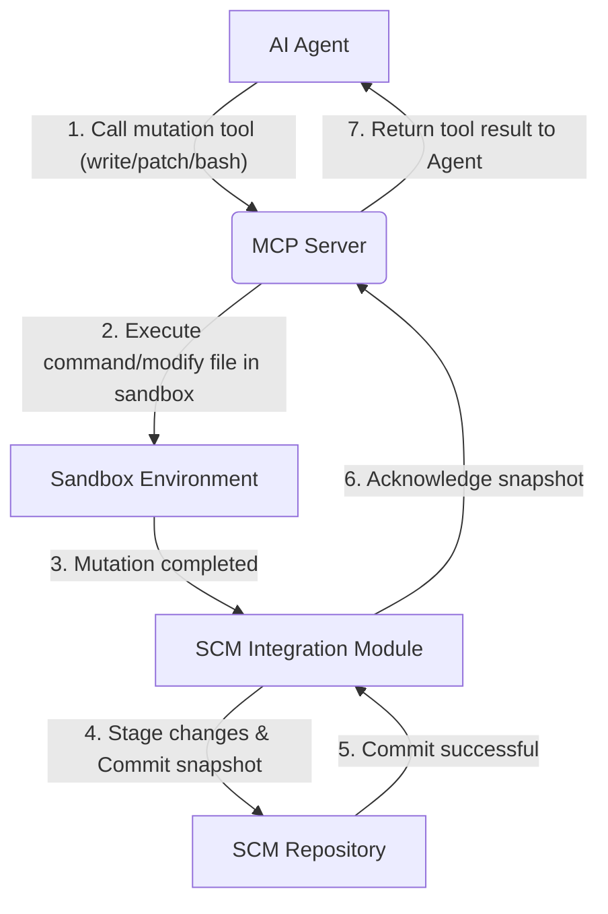

# ADR 2026-02-07-mcp-tools: Technical Plan for Model Control Protocol (MCP) Tools

## 1. Architecture Overview

The Litterbox MCP server is designed to facilitate seamless interaction between an AI agent and a sandboxed compute environment, with automatic persistence of changes to a source code management (SCM) repository. The core components are:

*   **AI Agent:** The consumer of the MCP tools, issuing commands to manipulate the sandbox.
*   **MCP Server:** The central orchestrator, exposing the MCP tools, managing the sandbox lifecycle, and implementing the auto-snapshotting mechanism.
*   **Sandbox Environment:** An isolated, ephemeral compute environment where the agent's commands are executed and file mutations occur.
*   **SCM Repository:** The persistent store for the project's source code, where automatic snapshots are committed.

The key architectural principle is to keep the agent SCM-agnostic. The agent focuses solely on modifying the file tree, while the MCP Server handles the underlying SCM operations transparently.

## 2. Technology Stack Justification

*   **MCP Server:**
    *   **Language:** Rust. Chosen for its performance, memory safety, and concurrency features, which are critical for a robust and efficient server handling multiple agent interactions and filesystem events.
    *   **Container Orchestration:** `bollard` (Rust Docker client). Leveraged for managing Docker containers as sandbox environments, providing isolation and consistent execution.

    *   **SCM Interaction:** `git2` (Rust Git bindings). Provides direct, low-level access to Git functionalities for creating and managing snapshot commits.
*   **Sandbox Environment:**
    *   **Technology:** Docker containers. Offers strong process and filesystem isolation, ensuring that agent actions do not affect the host system or other sandboxes. Provides a consistent and reproducible environment.
*   **SCM:**
    *   **Technology:** Git. Widely adopted, robust, and provides the necessary primitives for efficient snapshotting and history management.

## 3. Component Breakdown

### 3.1 Agent Harness
*   **Role:** The system or framework that hosts and manages the AI Agent. It provides the environment for the AI Agent to operate and invokes the MCP tools.
*   **Examples:** Claude Code, OpenAI Codex, OpenCode.
*   **Interface:** Interacts with the MCP Server via the defined MCP tool interfaces.

### 3.2 AI Agent
*   **Role:** Initiates tool calls (e.g., `write`, `patch`, `bash`, `read`).
*   **Interface:** Communicates with the MCP Server via the defined MCP tool interfaces.

### 3.2 MCP Server
This is the core component responsible for exposing the MCP tools and managing the sandbox. It will be implemented using the `rmcp` library.

*   **MCP Tool Handlers:** Implements the logic for each exposed MCP tool. These handlers will parse agent requests, interact with the sandbox environment, and return results. Specific handlers will be developed for:
    *   `read(sandbox: string, path: string, offset?: number, limit?: number)`: Returns the content of the file as a string from inside the sandbox. `offset` and `limit` are line-based (0-based offset, max lines = limit). Paths may be absolute within the container or relative to the sandbox workdir.
    *   `write(sandbox: string, path: string, content: string)`: Creates or overwrites a file inside the sandbox. Paths may be absolute within the container or relative to the sandbox workdir.
    *   `patch(sandbox: string, path: string, diff: string)`: Applies a unified diff (git-apply compatible) that may create, modify, or delete the file at `path` inside the sandbox. Paths may be absolute within the container or relative to the sandbox workdir.
    *   `bash(sandbox: string, command: string, workdir?: string, timeout?: number)`: Executes a shell command in the sandbox. `workdir` may be absolute within the container or relative to the sandbox workdir. Returns a struct containing `stdout` (string), `stderr` (string), and `exitCode` (integer).
    *   `ls(sandbox: string, path: string, recursive?: boolean)`: Returns a list of file names (strings) from inside the sandbox. Paths may be absolute within the container or relative to the sandbox workdir.
    *   `glob(sandbox: string, pattern: string, path?: string)`: Returns a list of file paths (strings) from inside the sandbox. `path` may be absolute within the container or relative to the sandbox workdir.
    *   `grep(sandbox: string, pattern: string, path: string, include?: string)`: Returns a list of strings, where each string represents a matching line. Paths may be absolute within the container or relative to the sandbox workdir.
*   **Sandbox Resolution:** Each tool call must resolve the `sandbox` name using the same slugification rules as `sandbox-create`, derive the container name using the repo prefix, and execute operations inside the container (via `SandboxProvider::shell`, `upload_path`, `download_path`).
*   **Sandbox Manager:**
    *   **Lifecycle Management:** Creates, starts, stops, and destroys sandbox containers.
    *   **Resource Allocation:** Manages CPU, memory, and disk limits for each sandbox.
    *   **File System Mounting:** Mounts the SCM repository into the sandbox environment.

*   **SCM Integration Module:**
    *   **Snapshot Creation:** Stages all detected changes within the mounted SCM repository and creates an automatic Git commit (snapshot). This process is triggered directly by mutation-capable tools (e.g., `write`, `patch`, `bash`) after their execution, and only when `git status` reports changes (no empty commits).
    *   **Commit Message Generation:** Generates a commit message that encodes the trigger (e.g., `bash: cargo test`, `write: path`, `patch: path`).
    *   **Branch Management:** Manages a dedicated branch or strategy for agent-generated snapshots to avoid polluting the main development branch.

### 3.3 Sandbox Environment
*   **Role:** Isolated execution environment for agent commands and file modifications.
*   **Configuration:** Configured with necessary dependencies and tools for the project.
*   **Persistence:** Changes made within the sandbox are reflected in the mounted SCM repository.

### 3.4 SCM Repository
*   **Role:** Stores the authoritative source code and the history of agent-generated snapshots.
*   **Access:** Accessed by the MCP Server for snapshotting.

## 4. Data Flow Diagrams

### 4.1 Agent Initiates Mutation and Auto-Snapshotting

## 5. Testing Strategy

*   **Unit Tests:**
    *   Individual MCP tool handlers (`read`, `write`, `patch`, `bash`, `ls`, `glob`, `grep`).
    *   Filesystem Watcher logic (change detection, event filtering).
    *   SCM Integration Module (staging, committing, branch management).
    *   Sandbox Manager (container lifecycle, resource limits).
*   **Integration Tests:**
    *   Agent-MCP Server communication for each tool.
    *   MCP Server-Sandbox interaction (correct command execution, file manipulation).
    *   Filesystem Watcher-SCM Integration Module handshake (changes detected, snapshot created).
*   **End-to-End Tests:**
    *   Simulate an agent's full workflow (e.g., read, modify, bash, verify).
    *   Verify that file changes in the sandbox are correctly reflected as SCM snapshots.
    *   Validate sandbox isolation and resource limits.
*   **Security Testing:**
    *   Ensure sandbox escape prevention.
    *   Verify that agents cannot access unauthorized paths or execute privileged commands.
    *   Test for resource exhaustion attacks.

## 6. Deployment Considerations

*   **Logging and Observability:**
    *   Comprehensive logging of all MCP tool calls, sandbox events, and SCM operations.
    *   Integration with existing monitoring systems for real-time insights into agent activity and system health.
*   **Scalability:**
    *   The MCP Server will be launched as a dedicated instance per agent interaction. Therefore, scalability considerations focus on efficient resource utilization for individual instances rather than horizontal scaling of a daemon.
*   **SCM Integration:**
    *   Configuration for SCM credentials and repository access.
    *   Strategy for managing agent-generated branches/commits (e.g., dedicated `litterbox-snapshots` branch).
*   **Error Reporting:**
    *   Clear and actionable error messages from MCP tools to the agent.
    *   Robust error handling within the MCP Server to prevent crashes and ensure system stability.
