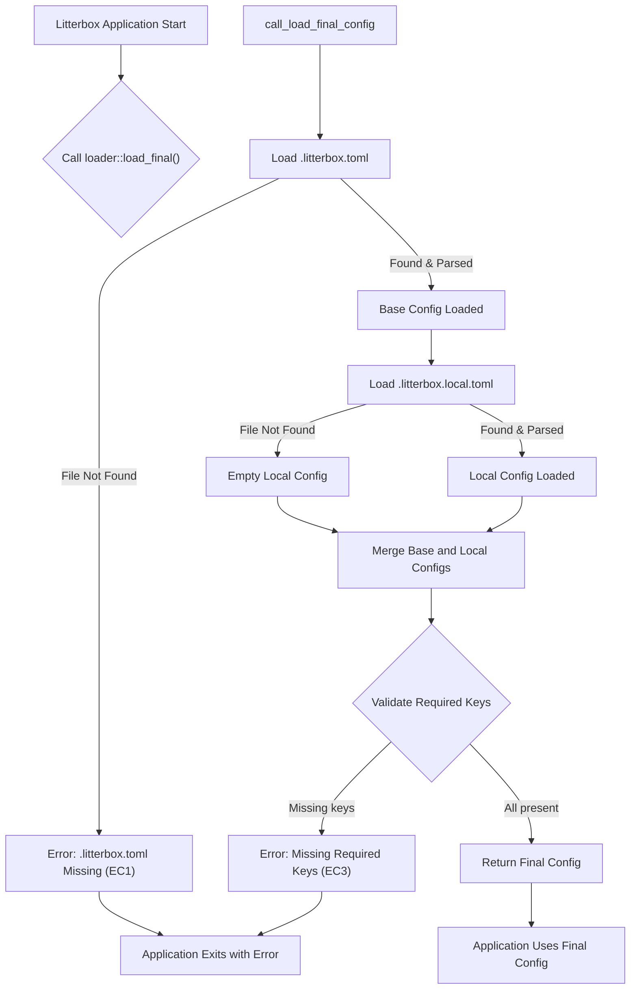

# ADR: Project Configuration Plan

## 1. Architecture Overview

The project configuration will be managed by a dedicated `config_loader` module within the Litterbox application. This module will be responsible for:
1.  Locating configuration files (`.litterbox.toml` and `.litterbox.local.toml`).
2.  Reading and parsing these files using the TOML format.
3.  Merging the configurations, with `.litterbox.local.toml` overriding values from `.litterbox.toml`.
4.  Validating the final merged configuration to ensure all required keys are present.
5.  Exposing the validated configuration through a well-defined API for other Litterbox components to consume.

The sandboxing implementation will be updated to retrieve necessary configuration values (e.g., `project.slug`, `docker.image`, `docker.setup-command`) from this central configuration rather than using statically assigned values.

## 2. Technology Stack Justification

-   **TOML (Tom's Obvious, Minimal Language):** As specified, TOML will be used for the configuration files. Its human-readable nature and clear structure make it suitable for project configuration.
-   **Rust `serde` and `toml` crates:** Given Litterbox is a Rust application, the `serde` framework combined with the `toml` crate provides a robust, efficient, and idiomatic solution for deserializing TOML files into native Rust data structures. `serde` allows for compile-time validation of the configuration structure and flexible mapping to Rust types.

## 3. Component Breakdown

### 3.1. `config_loader` Module

This module will encapsulate all configuration-related logic.

-   **`Config` Struct:**
    *   A Rust struct that defines the expected structure of the configuration.
    *   Will use `#[derive(Deserialize)]` from `serde` to enable automatic deserialization from TOML.
    *   Fields like `project_slug`, `docker_image`, `docker_setup_command` will be defined.
    *   `Option<T>` will be used for fields that might be absent in individual TOML files but are required in the final merged configuration, allowing for a two-stage validation (initial deserialization, then final validation).

-   **`load_file(path: &Path) -> Result<Config, ConfigError>`:**
    *   Reads the content of a specified TOML file.
    *   Parses the content into a `Config` struct using `toml::from_str`.
    *   Returns a `Result` indicating success or a `ConfigError` (e.g., `FileNotFound`, `ParseError`).

-   **`merge(base: Config, overlay: Config) -> Config`:**
    *   Takes two `Config` structs as input.
    *   Creates a new `Config` struct where values from `overlay` take precedence over `base`.
    *   This will involve iterating through fields and applying the override logic.

-   **`load_final() -> Result<Config, ConfigError>`:**
    *   The primary public interface for retrieving the configuration.
    *   Attempts to load `.litterbox.toml`. If not found, it returns an error (EC1).
    *   Attempts to load `.litterbox.local.toml`. If not found, it proceeds with an empty local config.
    *   Merges the two configurations.
    *   Performs final validation to ensure all required keys (`project.slug`, `docker.image`, `docker.setup-command`) are present in the merged configuration (EC3).
    *   Returns the final, validated `Config` struct or a `ConfigError`.

### 3.2. `ConfigError` Enum

A custom error enum to represent various configuration-related issues, such as:
-   `FileNotFound(PathBuf)`
-   `ParseError(toml::de::Error)`
-   `MissingRequiredKey(String)`

## 4. Data Flow Diagram

## 5. Testing Strategy

### 5.1. Unit Tests

-   **`load_file` Function:**
    *   Test with a valid TOML file containing all keys.
    *   Test with a valid TOML file containing only a subset of keys.
    *   Test with an empty TOML file.
    *   Test with an invalid TOML file (syntax errors).
    *   Test with a non-existent file (expect `FileNotFound` error).
-   **`merge` Function:**
    *   Test merging two configurations where the overlay has new keys.
    *   Test merging two configurations where the overlay overrides existing keys.
    *   Test merging with an empty overlay configuration.
    *   Test merging with an empty base configuration.
-   **`load_final` Function:**
    *   Test scenario: Only `.litterbox.toml` exists, all required keys present.
    *   Test scenario: Both `.litterbox.toml` and `.litterbox.local.toml` exist, with local overrides.
    *   Test scenario: `.litterbox.toml` is missing (expect `FileNotFound` error).
    *   Test scenario: `.litterbox.toml` exists, but a required key is missing (expect `MissingRequiredKey` error).
    *   Test scenario: Both files exist, but a required key is missing after merge (expect `MissingRequiredKey` error).

### 5.2. Integration Tests

-   Create a temporary project directory structure for each test case.
-   Populate these directories with various combinations of `.litterbox.toml` and `.litterbox.local.toml` files.
-   Invoke the Litterbox application (or relevant sandboxing component) and assert that the correct configuration values are being used.
-   Specifically, verify that the sandboxing implementation correctly retrieves `project.slug`, `docker.image`, and `docker.setup-command` from the merged configuration.
-   Test error conditions (e.g., missing `.litterbox.toml`, invalid TOML) and ensure the application exits gracefully with informative error messages.

## 6. Deployment Considerations

-   The configuration files (`.litterbox.toml` and `.litterbox.local.toml`) are project-specific and are expected to reside within the project's root directory. They will be managed by the user and checked into source control (for `.litterbox.toml`) or kept local (for `.litterbox.local.toml`).
-   The `config_loader` module will be compiled as part of the Litterbox application. No special deployment steps are required for the configuration mechanism itself beyond ensuring the application binary is available.

## 7. Risk Identification and Mitigation

-   **Risk: Complex Merging Logic:**
    *   **Description:** The logic for merging configurations, especially with nested structures or different data types, could become complex and error-prone.
    *   **Mitigation:** Keep the merging strategy simple: values in `.litterbox.local.toml` directly override corresponding values in `.litterbox.toml`. For nested structures, a deep merge might be considered, but for the initial scope, a shallow override of top-level keys is sufficient. Thorough unit tests for `merge_configs` will be crucial.
-   **Risk: Performance Overhead:**
    *   **Description:** Repeated file I/O and parsing of TOML files could introduce performance overhead if configuration is accessed frequently.
    *   **Mitigation:** The configuration will be loaded once at application startup and stored in an immutable `Config` struct. This struct will then be passed to components that require configuration, avoiding repeated file operations.
-   **Risk: Incompatible TOML Versions/Parsing Issues:**
    *   **Description:** Future changes in the TOML specification or issues with the `toml` crate could lead to parsing failures.
    *   **Mitigation:** Pin specific, stable versions of the `toml` and `serde` crates in `Cargo.toml`. Monitor upstream changes and update dependencies cautiously.
-   **Risk: Incomplete Migration of Statically Assigned Values:**
    *   **Description:** Some hardcoded configuration values in the sandboxing implementation might be missed during the migration to the new configuration system.
    *   **Mitigation:** Conduct a comprehensive code audit of the sandboxing implementation to identify all statically assigned values. Implement integration tests that specifically verify that these values are now being read from the configuration. Code reviews will also focus on this aspect.
-   **Risk: Poor Error Reporting:**
    *   **Description:** If configuration errors (e.g., missing files, invalid TOML, missing keys) are not reported clearly, it can lead to a poor user experience.
    *   **Mitigation:** Implement a custom `ConfigError` enum with descriptive variants. Ensure error messages are user-friendly and provide actionable information (e.g., file path, specific missing key).
