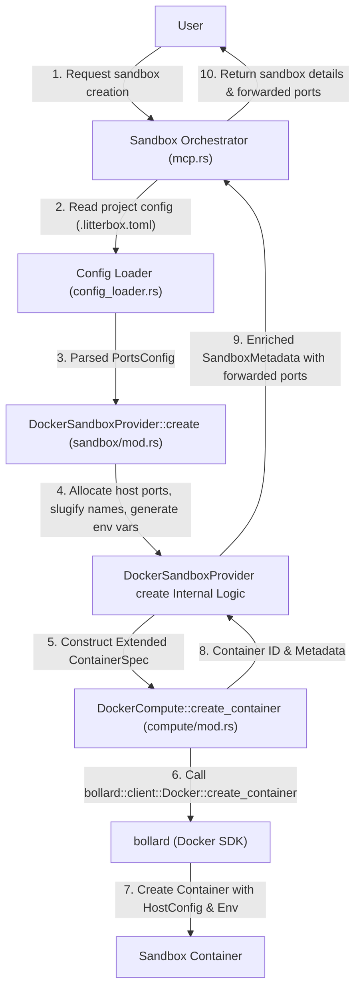
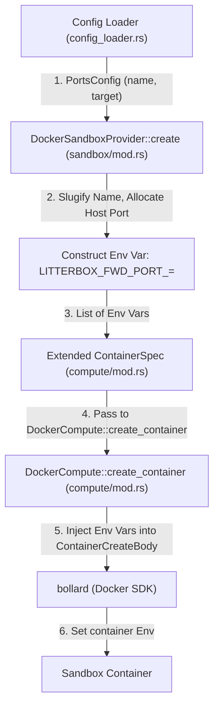
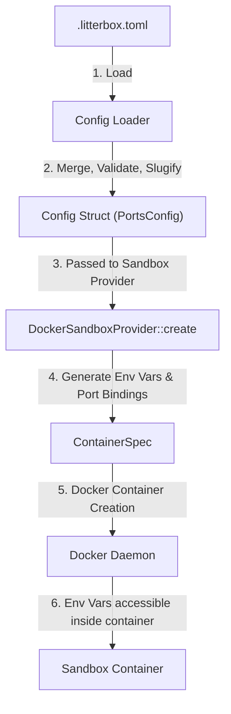

# Technical Plan: Port Forwarding for Sandbox Containers

## 1. Architecture Overview

The port forwarding mechanism will configure the appropriate sandboxing mechanism (Docker) to handle network flow, rather than actively managing it. This involves extending the project configuration to define desired container ports, dynamically allocating available host ports, injecting these mappings as environment variables into the sandbox containers, and returning the mapping information to the user via the `sandbox-create` tool. The core logic will reside within the existing `litterbox` application, primarily within the `config_loader` and `sandbox` modules.

## 2. Technology Stack Justification

The existing technology stack (Rust, `bollard` for Docker interaction, `serde` and `toml` for configuration) is suitable for implementing port forwarding.

*   **Rust**: Provides performance and type safety, crucial for reliable system-level operations.
*   **`bollard`**: This crate is already in use for Docker interactions, making it the natural choice for configuring container port mappings during creation.
*   **`serde` and `toml`**: These are used for handling configuration files (`.litterbox.toml`) and will be extended to parse the new port forwarding settings.

## 3. Component Breakdown

### 3.1. `litterbox.toml` Configuration Extensions (`src/config.rs`, `src/config_loader.rs`)

The `src/config.rs` file will be updated to define new data structures for port forwarding configuration.

*   A `PortsConfig` struct will be added, containing a `ports` field which is a `Vec` of `ForwardedPort` structs.
*   The `Config` struct will be extended to include a `ports: PortsConfig` field with a default empty list.
*   A `ForwardedPort` struct will define:
    *   `target: u16`: The port number inside the container to be forwarded.
    *   `name: String`: A logical name for the service (e.g., "web-server").

The `src/config_loader.rs` module will be enhanced to:

*   Load and validate the new `ports` section from `.litterbox.toml` and `.litterbox.local.toml`.
*   Implement slugification logic for the `name` field of `ForwardedPort` to create valid environment variable keys.
*   Detect and report conflicts if slugified names are not unique within a project's port configuration.
*   Ensure `default_config()` and `merge()` functions correctly handle the new `PortsConfig` structure.

Example `litterbox.toml` entry:

```toml
[[ports]]
name = "web-server"
target = 8080

[[ports]]
name = "database"
target = 5432
```

### 3.2. Port Allocation and Environment Variable Generation (`src/domain.rs`, `src/sandbox/mod.rs`)

This logic will be integrated within the `src/sandbox/mod.rs` module, specifically within the `DockerSandboxProvider` implementation.

1.  **Extend `SandboxConfig`**: The `SandboxConfig` struct (defined in `src/domain.rs`) will be extended to carry the parsed `PortsConfig` from the `config_loader`.

2.  **Host Port Allocation**: In `DockerSandboxProvider::create`, for each `ForwardedPort` from the `SandboxConfig`:
    *   A utility function will dynamically find an available host port within the default range 3000-8000. This will involve attempting to bind to the port and immediately unbinding to check availability.
    *   The allocated host port will be stored along with the `container_port` and slugified `name`.

3.  **Environment Variable Construction**: For each allocated host port and its corresponding slugified service name, an environment variable string will be generated: `LITTERBOX_FWD_PORT_<SLUGIFIED_SERVICE_NAME>=<HOST_PORT>`.

4.  **`SandboxMetadata` Extension**: The `SandboxMetadata` struct (returned by `provider.create()` and used by the MCP server) will be extended to include:
    *   `forwarded_ports: Vec<ForwardedPortMapping>`: A list of objects, each containing `target`, `host_port`, `name`, and `env_var`.

### 3.3. `DockerSandboxProvider` Modifications (`src/sandbox/mod.rs`, `src/compute`)

The `src/compute/mod.rs` file will need modifications to its `ContainerSpec` struct and `create_container` function.

1.  **Extend `src/compute/mod.rs::ContainerSpec`**:
    Add the following fields to the `ContainerSpec` struct:
    *   `pub env: Vec<String>`: A list of environment variable strings in `KEY=VALUE` form.
    *   `pub port_bindings: HashMap<String, Vec<bollard::models::PortBinding>>`: A map from container port (e.g., "8080/tcp") to a list of `bollard::models::PortBinding` structs.

2.  **Modify `src/compute/mod.rs::DockerCompute::create_container`**:
    This function will be updated to utilize the new fields in `ContainerSpec`.
    *   When constructing the `bollard::models::ContainerCreateBody`:
        *   The `env` field of `ContainerCreateBody` will be populated from `spec.env` when non-empty.
        *   A `bollard::models::HostConfig` will be created. Its `port_bindings` field will be populated from `spec.port_bindings` when non-empty. The `HostConfig` will then be assigned to the `HostConfig` field of `ContainerCreateBody`.

3.  **`DockerSandboxProvider::create` in `src/sandbox/mod.rs`**:
    This method will be updated to:
    *   Access the `PortsConfig` from the `SandboxConfig`.
    *   Perform host port allocation and environment variable generation (as described in section 3.2).
    *   Construct the `Vec<String>` for `env` to be passed to `ContainerSpec`.
    *   Construct the `HashMap<String, Vec<bollard::models::PortBinding>>` for `port_bindings` to be passed to `ContainerSpec`. For each `ForwardedPort`, a `bollard::models::PortBinding` will be created with `HostPort` set to the allocated host port (as a `String`) and `HostIp` set to "0.0.0.0". The key for the outer HashMap will be the `container_port` followed by "/tcp" (e.g., "8080/tcp").
    *   Create an enriched `ContainerSpec` with these `env` and `port_bindings`.
    *   Call `self.compute.create_container(&enriched_spec)`.
    *   Populate the `SandboxMetadata` with the generated `forwarded_ports`.

### 3.4. `sandbox-create` Tool Response (`src/mcp.rs`)

The `sandbox-create` handler within `src/mcp.rs` will:

*   Call `provider.create()` which now returns an enriched `SandboxMetadata`.
*   Serialize this `SandboxMetadata` (including the new `forwarded_ports` field) as JSON in its response to the client.

## 4. Data Flow Diagrams

(The existing data flow diagrams will be updated to reflect the new component interactions, specifically showing the `config_loader` processing the `ports` configuration and the `DockerSandboxProvider` handling port forwarding configuration, environment variable injection, and `ContainerSpec` modification before calling `DockerCompute::create_container`.)

### 4.1. Sandbox Creation with Port Forwarding (Updated)



### 4.2. Environment Variable Generation and Injection (Updated)



### 4.3. Configuration and Environment Variable Flow



## 5. Testing Strategy

*   **Unit Tests**:
*   `src/config.rs`: Test `PortsConfig` (de)serialization.
    *   `src/config_loader.rs`:
    *   Test parsing of `[[ports]]` entries from TOML.
    *   Test validation of `target` and `name`.
    *   Test slugification logic and ensure correct output (e.g., "My Web Server" -> "my-web-server" for env var construction).
    *   Test conflict detection for slugified names (e.g., two services resulting in the same slugified name).
    *   Test default and merge behavior for `PortsConfig`.
    *   `src/sandbox/mod.rs`:
        *   Test host port allocation logic in isolation, ensuring it finds available ports and handles exhaustion.
        *   Test environment variable generation based on `PortMappingEntry` and slugification.
*   **Integration Tests**:
    *   Verify end-to-end sandbox creation using `sandbox-create` with a `.litterbox.toml` specifying port forwarding.
    *   Assert that Docker containers are created with correct `PortBindings` and `Env` variables.
    *   Verify that the `sandbox-create` tool's JSON response contains accurate `forwarded_ports` and `environment_variables`.
    *   Test scenarios with multiple sandboxes, ensuring no host port conflicts between them.
    *   Test behavior with invalid `litterbox.toml` configurations (e.g., missing `name`, non-numeric port).
    *   Test that applications inside the container can correctly read the injected environment variables.
*   **System Tests**:
    *   Deploy and test the entire `litterbox` system with various projects utilizing port forwarding in a realistic environment.
    *   Performance testing for sandbox creation time with many port mappings.
    *   Verify stability and reliability of port forwarding over extended periods.

## 6. Deployment Considerations

*   The port forwarding feature will be implemented as an integral part of the `litterbox` application. No separate deployment artifacts are required.
*   The default host port range is 3000-8000; making this configurable is a future consideration.
*   Robust logging will be implemented for port allocation, conflicts, and environment variable injection to aid in debugging and monitoring. Existing `litterbox` logging mechanisms will be utilized.
*   Backward compatibility for existing `.litterbox.toml` files will be maintained; the `[[ports]]` section is optional and ignored if not present.
