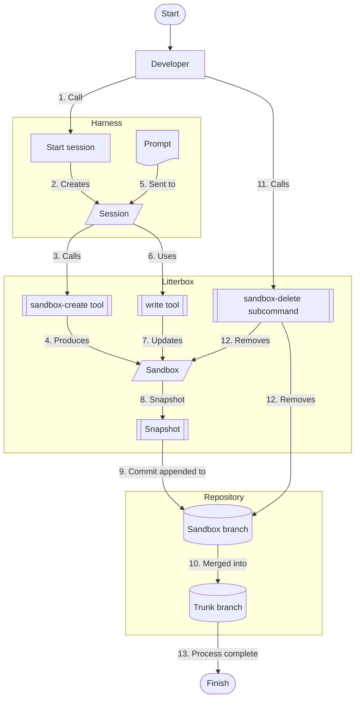

# 👋 Introducing Litterbox

Litterbox couples source control branching with compute sandboxes to provide AI coding agents with dedicated, isolated environments.

Each sandbox runs in its own container, with its own working copy. You configure your development harness (such as Cursor, Claude Code, or OpenCode) to restrict operations to Litterbox tools, ensuring all edits and executions occur within that sandbox. After each operation, Litterbox snapshots the container’s working copy and updates the corresponding branch in your host Git repository with the diff.

To allow you to interact with sandboxes, Litterbox can forward ports from servers running inside the sandbox to your local machine. It'll pick unused ports for each sandbox automatically.

## Workflow

To better visualise how Litterbox works, let's walk through a simple example of an agent spinning up a sandbox and writing a single file.

## Prerequisites

- A Docker engine, for instance:
  - Docker Desktop or similar
  - Lima or similar
